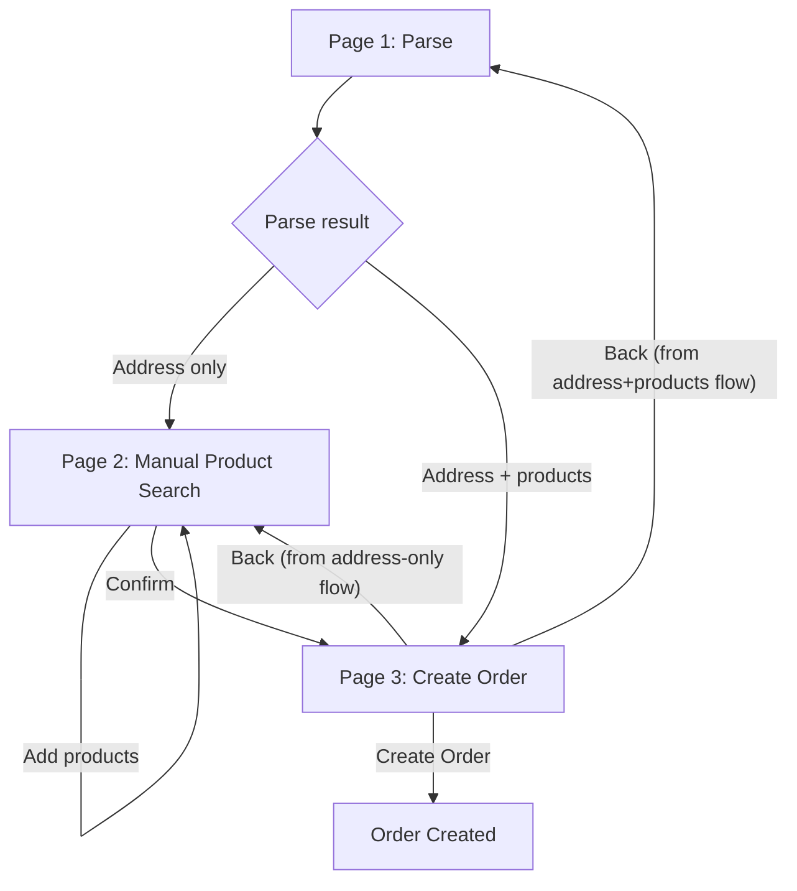

# Order Flow Diagram

```mermaid
flowchart TD
    A["Page 1: Parse"] --> B{"Parse result"}
    B -->|"Address only"| C["Page 2: Manual Product Search"]
    B -->|"Address + products"| D["Page 3: Create Order"]

    C -->|"Add products"| C
    C -->|"Confirm"| D

    D -->|"Back (from address-only flow)"| C
    D -->|"Back (from address+products flow)"| A
    D -->|"Create Order"| E["Order Created"]
```

